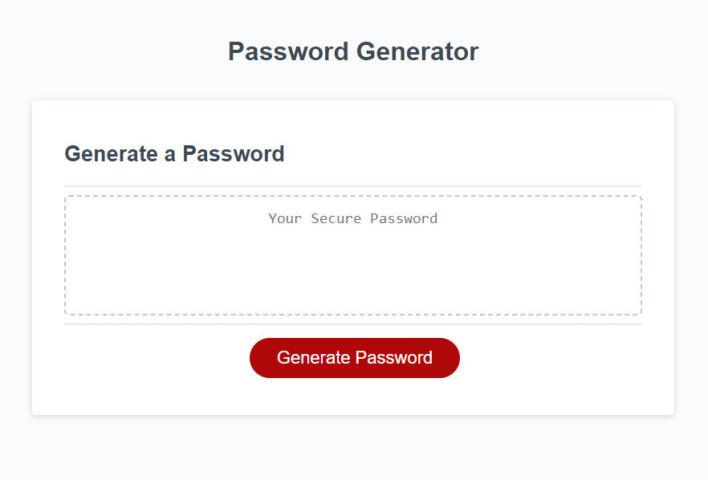

# 📖 JavaScript Challenge: Password Generator

## USER STORY
-The task in this project is to create a responsive, secure pasword generator tool that runs in the browser and uses HTML, CSS and JavaScript to execute. It also uses special charachters on a standard US keybooard to increase security.

## Acceptance Criteria

To generate a new password it must have meet these criteria as through a series of prompts:
    length range 8-128 charachters, defining the allowable charachter types(upper and lowercaes, numeric and or special charachters). When the person anwers each prompt at least one charachter type will be selected, a password is generated and an alert is diplayed or the text written on the page.  

## 📝 Notes

- It is done when the following (2) items are submitted:
  1.  The URL of the deployed application. 
      https://phagn131.github.io/password-generator/
  2.  The URL of the GitHub repository that contains your code. Give the repository a unique name and include a README file that describes the project.
      https://github.com/phagn131/password-generator

## Assets

- The following image demonstrates the web application's appearance and functionality:

