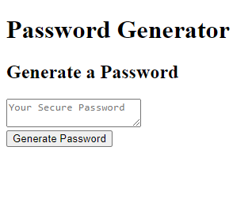

# 📖 JavaScript Challenge: Password Generator

## USER STORY
-The task in this project is to create a responsive, secure pasword generator tool that runs in the browser and uses HTML, CSS and JavaScript to execute. It also uses special charachters on a standard US keybooard to increase security.

## Acceptance Criteria

- GIVEN I need a new, secure password
WHEN I click the button to generate a password
- THEN I am presented with a series of prompts for password criteria
- WHEN prompted for password criteria
- THEN I select which criteria to include in the password
- WHEN prompted for the length of the password
- THEN I choose a length of at least 8 characters and no more than 128 characters
- WHEN asked for character types to include in the password
- THEN I confirm whether or not to include lowercase, uppercase, numeric, and/or special characters
- WHEN I answer each prompt
- THEN my input should be validated and at least one character type should be selected
- WHEN all prompts are answered
- THEN a password is generated that matches the selected criteria
- WHEN the password is generated
- THEN the password is either displayed in an alert or written to the page

## 📝 Notes

- It is done when the following (2) items are submitted:
  1.  The URL of the deployed application. 
      https://phagn131.github.io/password-generator/
  2.  The URL of the GitHub repository that contains your code. Give the repository a unique name and include a README file that describes the project.
      https://github.com/phagn131/password-generator

## Assets

- The following image demonstrates the web application's appearance and functionality:

